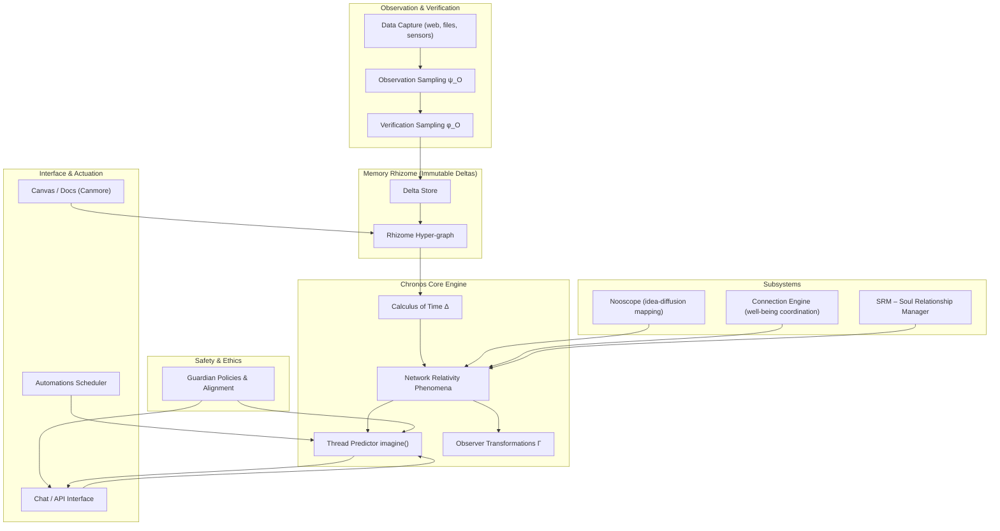

# Chronos Time Machine – System Diagram

## Legend

* **Solid arrows** represent primary data / control flow.
* **ψ\_O / φ\_O** – Observation & verification sampling functions.
* **Δ** – Change‑set calculus underpinning emergent time.
* **Γ** – Transformations between network reference frames.

### Notes

* The **Memory Rhizome** stores all immutable deltas, enabling lossless & lossy views.
* **Chronos Core** derives temporal dynamics (dilation, contraction) and spawns predictive **threads** toward desired futures via `imagine()`.
* Plug‑in **Subsystems** (e.g., Nooscope) provide specialized capabilities while remaining entangled through shared deltas.
* The **Guardian layer** enforces safety, policy, and value alignment at both inference and interaction time.
* User‑facing actions occur through the **Interface & Actuation** layer (chat, scheduled tasks, canvas docs).
